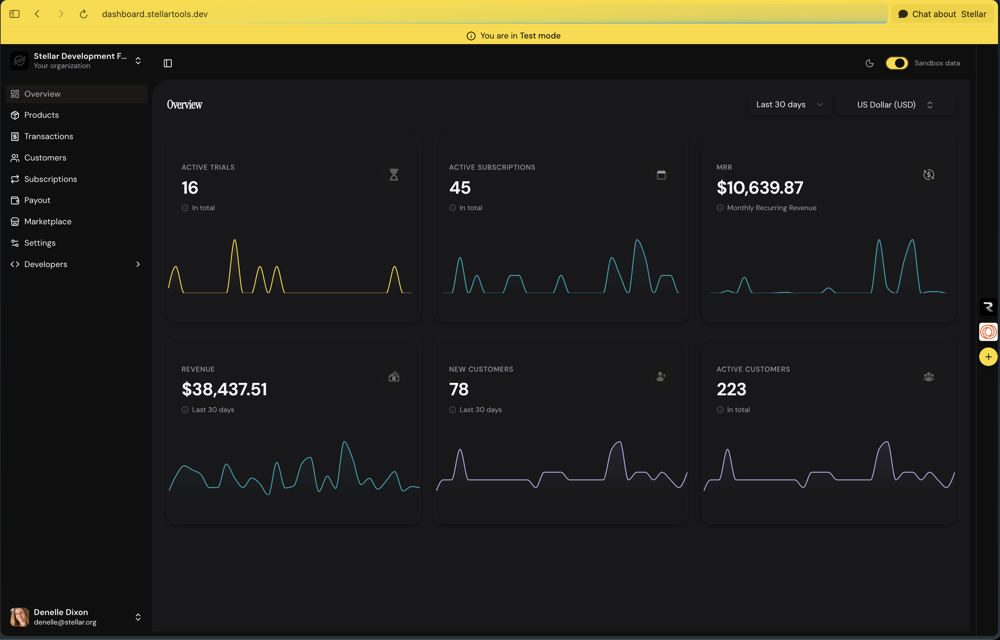

<p align="center">
  
  
</p>

<p align="center">
  Free, open-source, self-hosted payment infrastructure on Stellar.
</p>

<p align="center">
  <a href="https://docs.stellartools.dev">Docs</a> &bull;
  <a href="DEVELOPMENT.md">Self-Hosting</a> &bull;
  <a href="DOCKER.md">Docker Image</a> &bull;
  <a href="CONTRIBUTING.md">Contributing</a> &bull;
  <a href="ROADMAP.md">Roadmap</a> &bull;
  <a href="CHANGELOG.md">Changelog</a>
</p>

---

<p align="center">
  
</p>

## What is Stellar Tools?

Stellar Tools is Stripe-shaped payment infrastructure for the Stellar network — customers, checkouts, recurring subscriptions, webhooks, and crypto payouts. Free, with no plans and no cut taken from what you process. Use it two ways:

- **[dashboard.stellartools.dev](https://dashboard.stellartools.dev)** — a free hosted account, no infrastructure to run
- **Self-host it** — run your own instance (this repo), and hold your own Stellar keys end to end

- Accept payments in Stellar-native assets, with path payments so customers can pay with whatever they're holding
- Run subscriptions with real recurring billing, enforced on-chain by a Soroban smart contract you deploy and own
- Non-custodial checkout via [Stellar Wallets Kit](https://github.com/Creit-Tech/Stellar-Wallets-Kit) — customers sign with their own wallet
- Hosted checkout pages and a self-service customer portal
- Webhook delivery for payment and subscription lifecycle events
- Crypto payouts straight to any Stellar wallet
- A dashboard for customers, products, and payouts, plus a marketplace for integrations

## Why self-host

Self-hosting makes every deployment single-tenant — your instance, your database, your Stellar keys. Nobody but you can see your data or touch your funds. There's no billing relationship with anyone: this repo doesn't meter you, throttle you, or take a percentage, whether you self-host or use the free hosted account. The only recurring cost of running your own instance is the Stellar network fee your own "keeper" account pays to submit transactions — typically a fraction of a cent per operation.

## Getting started

Full setup is documented in **[DEVELOPMENT.md](DEVELOPMENT.md)**. The short version:

```bash
git clone https://github.com/payrouteshq/stellartools.git
cd stellartools
cp apps/web/.env.example apps/web/.env   # defaults work out of the box on localhost
docker compose up -d
```

That one command builds the app, starts Postgres and a local Stellar node, runs database migrations, and starts the dashboard at `dashboard.localhost:3000`. See [DEVELOPMENT.md](DEVELOPMENT.md) for deploying the subscription contract, going to production, and running without Docker.

## Tech Stack

- [Next.js](https://nextjs.org) 16 + [React](https://react.dev) 19 - framework
- [TypeScript](https://typescriptlang.org) - language
- [Tailwind CSS](https://tailwindcss.com) 4 - styling
- [PostgreSQL](https://www.postgresql.org) + [Drizzle ORM](https://orm.drizzle.team) - database
- [Stellar SDK](https://stellar.org) + [Soroban](https://soroban.stellar.org) - blockchain
- [pnpm](https://pnpm.io) workspaces

## Monorepo Structure

```
stellar-tools/
├── apps/
│   └── web/          # Next.js dashboard + marketing site (@stellartools/web)
└── packages/
    ├── shared-ui/    # Shared React component library (@stellartools/shared-ui)
    ├── stellartools/ # Core SDK (@stellartools/core)
    ├── app-sdk/      # Build metered integrations on top of Stellar Tools (@stellartools/app-sdk)
    ├── aisdk-adapter/
    ├── betterauth-adapter/
    ├── langchain-adapter/
    ├── medusajs-adapter/
    ├── uploadthing-adapter/
    └── woocommerce-adapter/
```

Everything in `packages/` is reusable outside this app too — pull in just the SDK or an adapter for your own stack.

## Packages

| Package                             | Description                                         |
| ------------------------------------ | ---------------------------------------------------- |
| `@stellartools/core`                | Core SDK for interacting with the Stellar Tools API   |
| `@stellartools/shared-ui`           | Shared React component library with Storybook         |
| `@stellartools/app-sdk`             | Build metered integrations on top of Stellar Tools    |
| `@stellartools/betterauth-adapter`  | BetterAuth integration                                |
| `@stellartools/aisdk-adapter`       | Vercel AI SDK integration                              |
| `@stellartools/medusajs-adapter`    | MedusaJS integration                                   |
| `@stellartools/uploadthing-adapter` | UploadThing integration                                |
| `@stellartools/langchain-adapter`   | LangChain integration                                   |

## Contributing

See [CONTRIBUTING.md](CONTRIBUTING.md) for the PR process and code style, and [DEVELOPMENT.md](DEVELOPMENT.md) to get your local environment set up.

Found a bug? [Open an issue](https://github.com/payrouteshq/stellartools/issues). Curious what's planned? See the [roadmap](ROADMAP.md).

## Security

See [SECURITY.md](SECURITY.md) for how to report a vulnerability.

## Maintained by

[Payroutes](https://payroutes.sh)

## License

MIT License. Copyright 2026 Payroutes.
